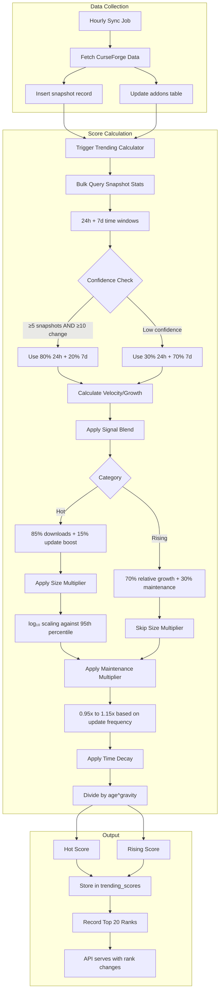
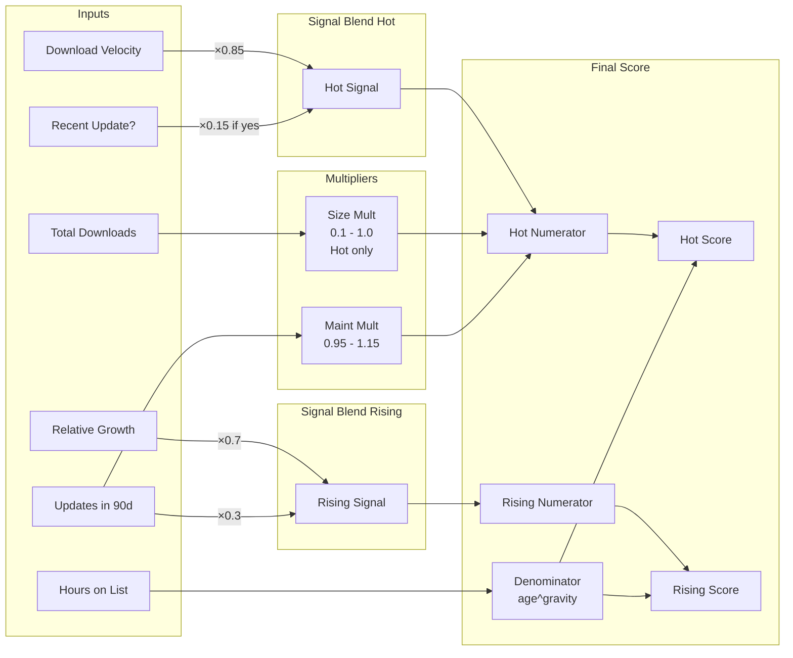

# Trending Algorithm

This document describes the trending algorithm used by Addon Radar to surface popular and rising World of Warcraft addons. It serves as the authoritative reference for how addon scores are calculated.

**Implementation:** `internal/trending/`
**Last Updated:** 2025-12-22
**Version:** 2.0

---

## 1. How Scoring Works

Addon Radar uses two trending categories, each designed to serve a different purpose:

### Hot Right Now

Surfaces **established addons** with strong recent activity. These are proven addons that many users are downloading right now.

- Requires at least 500 total downloads
- Uses **download velocity** (downloads per hour) as the primary metric
- Moderate decay rate keeps addons on the list for a stable period
- Top 20 displayed

### Rising Stars

Surfaces **emerging addons** gaining traction quickly. These are smaller addons that users might not discover otherwise.

- Requires between 50 and 10,000 total downloads
- Uses **relative growth** (downloads gained / total downloads) as the primary metric
- Aggressive decay rate cycles through discoveries quickly
- Excludes addons already in Hot Right Now
- Top 20 displayed

### Scoring Factors

Both scores are influenced by:

1. **Activity Signal** - Download velocity and recent updates blended together
   - **Hot Right Now**: 85% download velocity + 15% update boost
   - **Rising Stars**: 70% relative growth + 30% maintenance multiplier
2. **Size Multiplier** - Logarithmic scaling based on total downloads (Hot Right Now only)
3. **Maintenance Multiplier** - Bonus for addons with regular updates; penalty for abandoned addons
4. **Time Decay** - Scores decrease over time to cycle fresh content onto the lists

### Position Tracking

Addon Radar tracks trending positions over time to show movement:

- Records top 20 hot and rising ranks hourly
- Maintains 7-day history for rank changes
- API returns current rank, 24h change, and 7d change
- Helps users identify rapidly climbing addons

### Age Reset Mechanism

When an addon first qualifies for trending, it starts with age = 0. As time passes, its score decays. If the addon drops off the list, its age resets. When it re-qualifies, it starts fresh again. This prevents addons from being permanently penalized by accumulated decay.

---

## 2. Algorithm Flow



### Calculation Pipeline



---

## 3. Technical Details

### Core Formulas

#### Hot Right Now Score (v2)
```
hot_signal = (0.85 × download_velocity) + (0.15 × update_boost)
score = (hot_signal × size_multiplier × maintenance_multiplier) / (age_hours + 2)^1.5
```

#### Rising Stars Score (v2)
```
relative_growth = downloads_gained_24h / total_downloads
rising_signal = (0.7 × relative_growth) + (0.3 × maintenance_multiplier)
score = rising_signal / (age_hours + 2)^1.8
```

**Note:** Size multiplier is NOT applied to Rising Stars in v2. Relative growth naturally favors smaller addons without needing artificial scaling.

### Constants (v2)

| Constant | Value | Purpose |
|----------|-------|---------|
| `HotDownloadWeight` | 0.85 | Weight for download velocity in Hot signal |
| `HotUpdateWeight` | 0.15 | Weight for update boost in Hot signal |
| `RisingGrowthWeight` | 0.7 | Weight for relative growth in Rising signal |
| `RisingMaintenanceWeight` | 0.3 | Weight for maintenance in Rising signal |
| `UpdateBoost` | 10.0 | Boost value when addon has update in last 7 days |
| `HotGravity` | 1.5 | Decay exponent for Hot Right Now |
| `RisingGravity` | 1.8 | Decay exponent for Rising Stars |
| `AgeOffset` | 2.0 | Added to age to prevent division by zero |

**Removed in v2:**
- `ThumbsWeight` (0.2) - Thumbs up data removed due to low signal quality

### Signal Blend Calculation (v2)

#### Hot Right Now
```go
hot_signal = (0.85 × download_velocity) + (0.15 × update_boost)
```
- Uses download velocity (downloads per hour)
- Update boost = 10.0 if addon updated in last 7 days, else 0

#### Rising Stars
```go
relative_growth = downloads_gained_24h / total_downloads
rising_signal = (0.7 × relative_growth) + (0.3 × maintenance_multiplier)
```
- Uses relative growth percentage (0-1 scale)
- Maintenance multiplier blended into signal (not applied separately)

### Confidence-Based Adaptive Windows

The algorithm adapts between 24-hour and 7-day time windows based on data quality:

```go
confident := (data_points_24h >= 5) AND (change_24h >= 10)

if confident:
    velocity = (0.8 × velocity_24h) + (0.2 × velocity_7d)  // Fresh data
else:
    velocity = (0.3 × velocity_24h) + (0.7 × velocity_7d)  // Stable data
```

This ensures:
- Addons with frequent snapshots use responsive 24h data
- Addons with sparse data use reliable 7d averages

### Size Multiplier (Logarithmic Scale)

**Applied to Hot Right Now only.** Prevents tiny addons from dominating velocity-based metrics:

```go
multiplier = log₁₀(downloads + 1) / log₁₀(percentile_95 + 1)
clamped to [0.1, 1.0]
```

Example values (assuming 95th percentile = 500,000):

| Total Downloads | Multiplier |
|-----------------|------------|
| 10 | 0.18 |
| 100 | 0.35 |
| 1,000 | 0.53 |
| 10,000 | 0.70 |
| 100,000 | 0.88 |
| 500,000+ | 1.00 |

The 95th percentile is recalculated daily during sync.

**Not applied to Rising Stars in v2:** Relative growth calculation naturally favors smaller addons without needing artificial scaling.

### Maintenance Multiplier (Update Frequency)

Rewards active maintenance based on updates in the last 90 days:

| Update Frequency | Avg Days Between | Multiplier |
|------------------|------------------|------------|
| Very active | ≤14 days | 1.15× |
| Regular | 15-30 days | 1.10× |
| Occasional | 31-60 days | 1.05× |
| Baseline | 61-90 days | 1.00× |
| Stale/abandoned | No updates | 0.95× |

### Position Tracking (v2)

Addon Radar tracks trending positions over time to show rank changes:

**trending_rank_history Table:**
- Records top 20 hot and rising ranks hourly
- 7-day retention window (automatic cleanup)
- Enables rank_change_24h and rank_change_7d calculations

**API Response:**
```json
{
  "id": 123,
  "name": "Example Addon",
  "trending_rank": 5,
  "rank_change_24h": -2,   // Moved up 2 positions
  "rank_change_7d": +10,   // Moved down 10 positions over week
  "hot_score": 123.45
}
```

**Rank Change Calculation:**
- Negative = improved rank (moved up)
- Positive = worse rank (moved down)
- NULL = new to trending or no data for period

### Eligibility Thresholds

| Category | Min Downloads | Max Downloads | Additional |
|----------|---------------|---------------|------------|
| Hot Right Now | 500 | None | Positive velocity |
| Rising Stars | 50 | 10,000 | Positive growth, not in Hot |

### Calculation Schedule

| Calculation | Frequency |
|-------------|-----------|
| Trending scores | Hourly (after sync) |
| 95th percentile | Daily |
| Maintenance multiplier | Per calculation |

### Database Schema

#### trending_scores Table (v2)

Caches pre-calculated scores for fast API responses:

```sql
CREATE TABLE trending_scores (
    addon_id INTEGER PRIMARY KEY REFERENCES addons(id) ON DELETE CASCADE,

    -- Final scores
    hot_score DECIMAL(20,10) DEFAULT 0,
    rising_score DECIMAL(20,10) DEFAULT 0,

    -- Intermediate values (for debugging/analysis)
    download_velocity DECIMAL(15,5) DEFAULT 0,
    download_growth_pct DECIMAL(10,5) DEFAULT 0,
    size_multiplier DECIMAL(5,4) DEFAULT 1.0,
    maintenance_multiplier DECIMAL(5,4) DEFAULT 1.0,

    -- Age tracking (for gravity decay)
    first_hot_at TIMESTAMPTZ,      -- When addon first qualified for Hot
    first_rising_at TIMESTAMPTZ,   -- When addon first qualified for Rising

    calculated_at TIMESTAMPTZ DEFAULT NOW()
);

-- Partial indexes for fast top-20 queries
CREATE INDEX idx_trending_hot ON trending_scores(hot_score DESC) WHERE hot_score > 0;
CREATE INDEX idx_trending_rising ON trending_scores(rising_score DESC) WHERE rising_score > 0;
```

**Removed in v2:**
- `thumbs_velocity` - Thumbs up signal removed
- `thumbs_growth_pct` - Thumbs up signal removed

#### trending_rank_history Table (v2)

Tracks trending positions over time:

```sql
CREATE TABLE trending_rank_history (
    id BIGSERIAL PRIMARY KEY,
    addon_id INTEGER NOT NULL REFERENCES addons(id) ON DELETE CASCADE,
    category VARCHAR(10) NOT NULL,  -- 'hot' or 'rising'
    rank INTEGER NOT NULL,           -- 1-20
    recorded_at TIMESTAMPTZ NOT NULL DEFAULT NOW()
);

CREATE INDEX idx_rank_history_addon_category_time
    ON trending_rank_history(addon_id, category, recorded_at DESC);
CREATE INDEX idx_rank_history_recorded_at
    ON trending_rank_history(recorded_at DESC);
```

**Features:**
- Records top 20 rankings hourly
- 7-day retention (automatic cleanup)
- Supports rank change calculations (24h, 7d)

#### snapshots Table

Time-series data used for velocity/growth calculations:

```sql
CREATE TABLE snapshots (
    id BIGSERIAL PRIMARY KEY,
    addon_id INTEGER NOT NULL REFERENCES addons(id) ON DELETE CASCADE,
    recorded_at TIMESTAMPTZ NOT NULL DEFAULT NOW(),
    download_count BIGINT NOT NULL,
    thumbs_up_count INTEGER,
    popularity_rank INTEGER,
    rating DECIMAL(3,2),
    latest_file_date TIMESTAMPTZ
);

CREATE INDEX idx_snapshots_addon_time ON snapshots(addon_id, recorded_at DESC);
CREATE INDEX idx_snapshots_recorded_at ON snapshots(recorded_at DESC);
```

### Source Files

| File | Purpose |
|------|---------|
| `internal/trending/trending.go` | Pure calculation functions (formulas, constants) |
| `internal/trending/calculator.go` | Orchestration, bulk queries, database interaction |
| `internal/trending/trending_test.go` | Unit tests for all formulas |
| `sql/queries.sql` (lines 105-267) | SQL queries for snapshot stats and trending scores |

---

## 4. Future Enhancements

Potential improvements to explore:

| Enhancement | Description |
|-------------|-------------|
| Reddit mentions | Use mentions of addons in popular reddit subreddits to boost visibility |
| Wago.io data | Investigate integrating Wago.io download stats for a more holistic view |
| wowinterface.com data | Explore using wowinterface.com download data as an additional signal |
| Batch upserts | Optimize the remaining individual upsert operations |
| A/B testing framework | Experiment with formula tweaks |

---

## Changelog

| Date | Change |
|------|--------|
| 2025-12-22 | **v2 Algorithm Deployed** - Removed thumbs signal, added relative growth for Rising, added position tracking |
| 2025-12-17 | Initial documentation created |
| 2025-12-11 | Bulk query optimization implemented (10+ min → <30s) |
| 2025-12-10 | Algorithm implemented and deployed |
| 2025-12-08 | Original design completed |

## Version History

### v2.0 (2025-12-22)

**Key Changes:**
1. **Removed thumbs_up signal** - Data quality was too low (most addons had 0-1 thumbs up)
2. **Hot Right Now formula updated:**
   - Signal: 85% download velocity + 15% update boost (was 70/20/10)
   - Removed thumbs signal entirely
3. **Rising Stars formula updated:**
   - Now uses **relative growth** (downloads_gained / total_downloads)
   - Signal: 70% relative growth + 30% maintenance multiplier
   - **Removed size multiplier** - Relative growth naturally favors smaller addons
4. **Position tracking added:**
   - New `trending_rank_history` table
   - Records top 20 hot and rising ranks hourly
   - 7-day retention window
   - API returns rank_change_24h and rank_change_7d

**Why These Changes:**
- Thumbs up data was essentially useless - most addons had 0-1 thumbs
- Relative growth better surfaces lesser-known addons gaining traction
- Position tracking shows trending movement over time
- Simplified formulas while improving signal quality

### v1.0 (2025-12-10)

Initial implementation with:
- Hot Right Now and Rising Stars categories
- Multi-signal blend (downloads, thumbs, updates)
- Size multiplier for both categories
- Maintenance multiplier
- Confidence-based adaptive time windows
